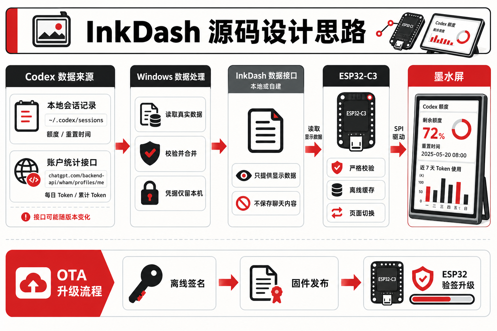

# InkDash ESP32-C3 三色墨水屏仪表盘

InkDash 把 7.5 寸、800×480、黑白红三色电子纸改造成常驻桌面的数据仪表盘。设备端使用 ESP32-C3；电脑端读取 Codex 数字用量，整理成小型 JSON 接口；墨水屏只接收经过校验的数字和图片包。



当前公开版包含：

- Codex 周额度、重置时间、近 7 日 Token 和账号累计数据；
- 一个通用服务器状态页，不绑定服务商；
- 可从局域网更新并离线缓存的三色壁纸页；
- 可由健康数据 JSON 生成的三色健康摘要页；
- 手机配网、USB 维护指令、断网缓存、按键换页；
- 4 MB Flash 的 A/B 数据存储；
- 首次完整备份、只写应用分区的保护式烧录；
- 可选的 ECDSA P-256 签名 OTA 与应用级回滚。

## 先确认硬件

这套固件的已验证硬件基线是：

- ESP32-C3，4 MB Flash；
- 7.5 寸 800×480 黑白红三色屏；
- UC8179 类控制器，代码默认驱动类为 `GxEPD2_750c_Z08`；
- EPD 引脚：`CS 7 / DC 2 / RST 8 / BUSY 10 / CLK 4 / MOSI 6`；
- 电池采样：`GPIO0`，采样使能：`GPIO20`；
- 触摸输入：`GPIO9` 和 `GPIO3`；
- 内部 USB-C 连接 ESP32-C3 原生 USB，可烧录和读串口；外部 USB-C 在当前结构中主要承担供电/充电。

屏幕尺寸相同，并不能保证排线、波形、驱动芯片和 GPIO 相同。下单前请按[硬件参考购买与到货核对](docs/hardware-reference.zh-CN.md)逐项确认。

## 最短复刻路径

1. 准备匹配的屏幕、ESP32-C3 控制/驱动板、数据线和稳定 5 V 电源。
2. 到货后先保留原有画面，拍清屏幕背标、FPC 字样、PCB 丝印和电池极性。
3. 使用内部 USB-C 连接电脑，先完成 4 MB 全量备份。
4. 复制 `include/secrets.example.h` 为 `include/secrets.h`，填写电脑的局域网地址。
5. 启动 `host/dashboard_server.py`，先在浏览器打开 `/health` 和 `/dashboard`。
6. 使用 PlatformIO 编译，再用保护式脚本只写当前应用分区。
7. 手机连接 `InkDash-Setup-XXXXXX` 完成 Wi-Fi 配置，或通过内部 USB-C 下发 Wi-Fi。
8. 屏幕出现真实数据后，再配置壁纸、健康页和 OTA。

完整操作见[从参考购买到日常使用的完整复刻教程](docs/build-guide.zh-CN.md)。

## 目录

```text
inkdash-esp32/
├─ include/                 ESP32 配置、数据结构和模块接口
├─ src/                     固件实现
├─ host/                    Windows/Linux 局域网数据服务
├─ assets/                  可编辑页面模板与生成后的三色底图
├─ tools/                   壁纸、健康页和固件资源生成工具
├─ scripts/                 备份、首刷、USB 维护和签名 OTA 工具
├─ config/                  通用服务器页示例配置
├─ tests/                   原生记录格式、服务端和工具测试
└─ docs/                    硬件、架构、接口、制作与排错文档
```

## 文档入口

- [硬件参考购买与到货核对](docs/hardware-reference.zh-CN.md)
- [完整复刻教程](docs/build-guide.zh-CN.md)
- [源码设计与踩坑记录](docs/architecture.zh-CN.md)
- [局域网数据接口约定](docs/api-contract.zh-CN.md)
- [签名 OTA 与回滚](docs/ota.zh-CN.md)
- [安全说明](SECURITY.md)

## 快速启动数据服务

安装 Python 3.11 或更新版本。在仓库根目录执行：

```powershell
python .\host\dashboard_server.py --bind 0.0.0.0 --port 8767
```

同一台电脑打开：

```text
http://127.0.0.1:8767/health
http://127.0.0.1:8767/dashboard
```

再用 `ipconfig` 找到电脑的局域网 IPv4 地址，把它填入 `include/secrets.h`：

```cpp
#define INKDASH_API_ORIGIN "http://192.168.1.100:8767"
```

`192.168.1.100` 只是示例，必须替换为你的电脑地址。账号凭据只在电脑端用于请求，ESP32 接收的响应中没有 Token、Cookie、账号 ID 或聊天正文。

## 编译

```powershell
python -m pip install -r requirements-dev.txt
pio run
```

公开版 `1.0.0` 的验证结果：RAM `137,716 / 327,680` 字节（42.0%），应用内容 `1,015,110 / 1,376,256` 字节（73.8%），生成的 `firmware.bin` 为 `1,066,464` 字节。

资源模板修改后，重新生成：

```powershell
python .\tools\render_frame_templates.py
python .\tools\generate_frame_assets.py
python .\tools\generate_header_glyphs.py
pio run
```

## 项目边界

- 仓库没有把某张商城 BOM 截图包装成可投产 PCB 文件。公开生产至少需要同一修订版的 Gerber、Drill、带位号 BOM、CPL、装配图和首板验证记录。
- `GDEY075Z08` 与现有规格高度接近，仍需以手中屏幕背标和实机三色测试确认。
- 电池容量、尺寸、插头和极性没有统一型号。第一次调试建议先用 USB 供电。
- 外壳需要跟 PCB 修订、屏幕外形、电池厚度、按键和接口开孔一起验证；仓库暂不提供未经实装的 STL。
- Codex 账号统计接口属于桌面端使用的非公开后端，未来可能变化。局部会话 JSONL 读取保留为降级数据源。

## 开源许可

固件链接了 GPL-3.0 的 GxEPD2，因此本仓库按 [GPL-3.0](LICENSE) 发布。其他依赖和参考项目见 [THIRD_PARTY_NOTICES.md](THIRD_PARTY_NOTICES.md)。
